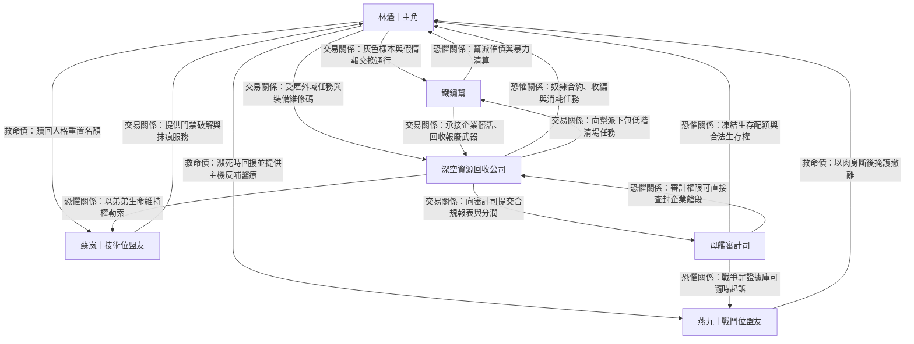

# 勢力與關鍵角色設定 (動態仇恨鏈)

這份文件定義了主角在各個階段將遭遇的勢力。**寫作核心準則：每個勢力存在的目的，都是為了卡主角的脖子（壟斷資源），並成為主角的經驗包。**

## 核心角色關係圖

> 用途：快速檢視主角團與外部勢力的利益鏈、壓制鏈與人情鏈，方便在章回中安排背叛、談判與救援戲。
>
> **圖例**
> - **交易關係**：以資源、情報、庇護或通行權交換為主。
> - **恐懼關係**：一方掌握生殺或制度性懲罰，另一方因風險而服從。
> - **救命債**：在生死事件中形成的高黏性人情鏈，通常會壓過短期利益。

**寫作使用建議**
- 每次重大衝突前，先確認本章啟動的是哪一種關係線，避免角色動機漂移。
- 若要安排背叛情節，優先從「交易關係」切入；若要安排犧牲高光，優先從「救命債」切入。
- 「恐懼關係」建議每 3～5 章重申一次具體懲罰手段，維持制度壓迫感。

---

## 1. 艙底幫派：鐵鏽幫 (前期主要敵人 / 經驗包)
_活動範圍：主角開局所在的微光區（底層）_

*   **壟斷資源 (卡脖子點)**：
    *   壟斷**底層黑市的抗輻射藥劑**。
    *   把持前往「近域拾荒帶」的**廉價偷渡通道**（收 30% 拾荒抽成）。
*   **首要衝突點 (Friction Point)**：
    *   主角第一天就繳不出「保護費」與「氧氣稅」，幫派打手準備將主角抓去解剖賣器官。主角必須反殺他們以獲得初期啟動資金。
*   **戰鬥兵種 (Combat Style)**：
    *   **劣質義體打手**：裝備二手工業機械臂，力量大但關節會漏油，弱點是後頸的神經接口。
    *   **毒氣噴射兵**：攜帶廢料酸液，會造成範圍腐蝕。

---

## 2. 承包軍與企業聯盟 (第一卷中後期敵人 / 灰色盟友)
_代表勢力：深空資源回收公司 (Deep Space Salvage Corp.)_

*   **壟斷資源 (卡脖子點)**：
    *   壟斷**高階武器、防具與正規醫療設備**。
    *   唯一擁有「外域裂縫」正規開採權的單位。主角想進高等副本刷寶，必須偽裝或受雇於他們。
*   **首要衝突點 (Friction Point)**：
    *   主角的拾荒成果引起了某位企業主管的貪婪。主管試圖用「終身奴隸合約」套牢主角，並在此過程中將主角的隊友當作消耗品推入外域裂縫送死。
*   **戰鬥兵種 (Combat Style)**：
    *   **外骨骼傭兵**：遠防禦力極高，配備電磁步槍與戰術協同 AI。
    *   **戰術無人機群**：負責偵查與自爆，會逼主角使用「文明主機」的感知能力來反制。

---

## 3. 母艦審計司 (懸在頭頂的達摩克利斯之劍)
_代表勢力：統治階級的直屬獵犬_

*   **壟斷資源 (卡脖子點)**：
    *   壟斷**「合法生存權」與「資料庫」**。他們能一鍵凍結你的所有帳戶與氧氣配額。
*   **首要衝突點 (Friction Point)**：
    *   主角實力增長過快，或者在某次行動中展現了「不屬於這個階級」的規則能力，觸發了系統的【異常成長警報】。一名審計官被派來追殺或「收編」主角。
*   **戰鬥兵種 (Combat Style)**：
    *   **審計官 (菁英 Boss)**：配備高層下放的「規則級裝備」（例如能短暫消除動能的力場），肉體完美無瑕（無義體），戰鬥極度冷靜精準。
    *   **清理者小隊**：無痛覺、無感情的量產型改造人特種部隊。

---

## 4. 主角陣營 (第一卷可用工具人設定)

*   **主角：林燼**
    *   核心動機：賺取「存活點」，解鎖主機階段，一路往上層殺去。

### 核心盟友補完（高風險合作檔案）

| 核心盟友                            | 既有定位                                                                                               | 不可替代資產                                                                                                       | 致命弱點                                                                   | 被高層控制把柄                                                                   | 與主角價值衝突點                                                                 | 可觸發黑化條件                                                                                 |
| ----------------------------------- | ------------------------------------------------------------------------------------------------------ | ------------------------------------------------------------------------------------------------------------------ | -------------------------------------------------------------------------- | -------------------------------------------------------------------------------- | -------------------------------------------------------------------------------- | ---------------------------------------------------------------------------------------------- |
| **戰鬥位盟友：燕九（肉盾 / 拖延）** | 功能：正面火力、掩護撤離、幫主角扛下正規軍第一波集火。人物弧：從拿錢辦事的下層傭兵，轉為與主角綁定。   | 熟悉艙段狹窄戰場與企業傭兵戰術，能在 10 秒內判斷最優撤離線；且持有一套「報廢外骨骼軍規維修碼」，可讓隊伍裝備續命。 | 神經抑制劑成癮，若 72 小時不補藥，會出現戰鬥顫抖與暴怒失控。               | 早年替企業做過「清場任務」的執行錄像仍在審計司資料庫，足以定義他為戰爭罪責任人。 | 主角傾向長期佈局與保密；燕九習慣立刻報復、以暴制暴，常要求正面清算。             | 主角若為大局犧牲底層平民，或放棄救回燕九舊隊員，燕九可能認定主角與企業無異而倒戈。             |
| **技術位盟友：蘇岚（駭客 / 後勤）** | 功能：駭入企業門禁、偽造假身分、抹除審計司追蹤訊號。人物弧：因巨額債務面臨人格重置，被主角救下後效忠。 | 掌握「轉化區稅流稽核 API」灰色後門，可即時改寫小隊信用評分與物流權限，是團隊能在系統內隱形行動的關鍵。             | 對記憶完整性有病態執著；一旦發現記憶遭竄改，會優先自保並切斷所有外部連線。 | 她弟弟仍在企業教育艙作為「優先培養樣本」，企業可用探視權與生命維持權綁架她。     | 主角相信「必要時可操弄真相」；蘇岚堅持資料不可偽造到傷及無辜，拒絕無差別資訊戰。 | 若主角利用她的後門去製造大規模民生事故，或故意犧牲她弟弟換戰略優勢，她會把主角標記為最高威脅。 |

---

## 5. 區域承包勢力：安流保全 (過渡區壓迫節點)
_活動範圍：第十三段「鐵鏽帶冷凝層」與周邊通行閘_

*   **收入來源**：
    *   冷凝層通行費與「躍階氧稅」抽成。
    *   污染風險押金的滯留利差（故意延後退還）。
*   **壟斷手段**：
    *   壟斷冷凝層二號與四號閘門權限，能用「設備檢修」名義臨時封鎖路線。
    *   控制區域監控演算法白名單，對特定隊伍提高抽檢頻率。
*   **對主角態度**：
    *   初期視為可被榨取的高收益對象，傾向用稅務與押金先耗死再收編。
    *   當主角連續三次突破封鎖後，將其升級為「秩序擾動源」，並通報審計司。
*   **首要衝突點 (Friction Point)**：
    *   安流保全扣押主角隊伍的污染押金，逼迫主角在 12 小時內補件；主角若硬闖，會被直接掛上高風險標記。
*   **戰鬥兵種 (Combat Style)**：
    *   **冷凝盾衛**：重裝防暴盾 + 低溫泡沫噴槍，擅長封走廊與拖時間。
    *   **閘控技師**：不正面作戰，透過門禁、斷電與氣壓閥切割戰場。

---

## 6. 污染金融勢力：清譜會 (制度型敵人 / 中期壓迫節點)
_活動範圍：公轉化區高污染貨場、降級艙段交界、封艙倒數區_

*   **收入來源**：
    *   污染押金的滯留利差與延淨插隊費。
    *   清艙估值、污染貨打包轉售、末批產出資產清算抽成。
*   **壟斷手段**：
    *   掌握董事會外包的污染評級模型與淨化排序權。
    *   壟斷「清艙證明」與高污染貨交接資格，能一句話把好貨打成廢貨。
*   **對主角態度**：
    *   初期視為高收益獵物，傾向先高估污染值再逼其折價出貨。
    *   當主角開始穩定逆轉污染收益後，將其標記為「破壞清算秩序者」，聯動審計司與承包商封殺。
*   **首要衝突點 (Friction Point)**：
    *   清譜會把主角隊伍帶出的高價樣本重判為污染超標，凍結 48 小時押金並要求轉賣給指定買家；主角若拒絕，整隊人的延淨排序就會被排到最後。
*   **戰鬥兵種 (Combat Style)**：
    *   **污值核算師**：攜帶手持讀數槍與封條槍，擅長把現場讀數變成不可推翻的「合規事實」。
    *   **白膜搬運隊**：穿全封閉白膜防護裝的押運單位，以泡沫束網和低溫噴劑控制高污染貨與鬧事者。
    *   **延淨仲裁員**：不一定正面出手，但掌握淨化排序與押金凍結權，一句延後淨化就能逼垮整支隊伍。

---

## 7. 封鎖帶領港勢力：盲舵會 (高風險合作對象 / 死艙入口節點)
_活動範圍：降級艙段外圍、死艙封鎖門、維護封存通道_

*   **收入來源**：
    *   過期門禁碼、舊航道導航、切艙工班租用費。
    *   封鎖突破的固定佣金與探索收穫抽成。
*   **壟斷手段**：
    *   掌握舊維修紀錄、壓差節點、艙外維修索道與死人名冊，知道哪些封鎖門只是名義封死。
    *   從不出售完整路線，只拆分時窗、門碼與轉向點，確保所有隊伍都無法一次性脫離掌控。
*   **對主角態度**：
    *   起初把主角視為敢進高風險區的肥客，願意高價合作。
    *   若主角掌握黑盒子或舊航道真圖，就會被視為必須綁上船或直接滅口的變數。
*   **首要衝突點 (Friction Point)**：
    *   盲舵會承諾提供安全路線，卻在第二道封鎖門前臨時加價，甚至把同一組門碼賣給競爭隊伍，逼主角在死艙邊界同時應付封鎖與伏擊。
*   **戰鬥兵種 (Combat Style)**：
    *   **舊圖師**：利用假訊標與信號擾動器扭曲導航判讀，讓追兵與客戶都走錯路。
    *   **切艙工**：使用靜音切割鉗、爆栓與磁吸攀具突破封門，擅長在狹窄艙壁戰中突襲。
    *   **引路人**：熟悉壓差節點與臨時撤離孔，會以纜索槍和短衝鋒武器邊撤邊打。

---

## 8. 動員型宗教外包：續焰團 (民心型敵人 / 長線滲透節點)
_活動範圍：第七段底層救濟站、灰雨市場周邊、降級艙段轉運前哨_

*   **收入來源**：
    *   招募佣金、志願遠征分潤、與企業 / 承包軍的人口供應合約。
    *   救濟站配給差價與官方宣講補貼。
*   **壟斷手段**：
    *   壟斷多個低價氧吧、施粥站與「奉航志願書」登記口，讓救濟與徵募綁定。
    *   借恆航教語彙為高風險任務洗白，把自願名冊直接送進末批產出或危險外勤。
*   **對主角態度**：
    *   初期想把主角包裝成底層逆襲的招牌見證，吸納其灰鏈聲望與街區信任。
    *   主角拒絕並拆穿後，便將其定性為「假火種」與煽動墮航的異端。
*   **首要衝突點 (Friction Point)**：
    *   續焰團在主角熟悉的街區發放低價氧包，條件是簽下三趟奉航志願書；主角若當場拆穿契約真相，就會立刻引爆一場民心對撞與群眾失控。
*   **戰鬥兵種 (Combat Style)**：
    *   **引焰使**：使用廣播陣列、興奮霧與話術引爆群眾情緒，把宣講現場轉成壓力場。
    *   **餘燼修士**：平時經營救濟站，衝突時會啟用拘束帶、鎮靜針與臨時收容籠控制志願者。
    *   **奉航監督**：負責押運簽約者前往轉運點，佩帶電擊短棍與追蹤扣環，作風接近企業押運員。

---

## 9. 寫作套用模板 (勢力互動公式)

*   **幫派 × 企業**：黑手套關係。企業把髒活發包給幫派，幫派用企業報廢的武器作威作福。主角可以利用這層關係挑撥離間。
*   **主角團 × 各方**：絕不正面對抗整個組織。依靠主機帶來的「規則資訊差」與「局部機動性」，每次只打對方的其中一個節點。
