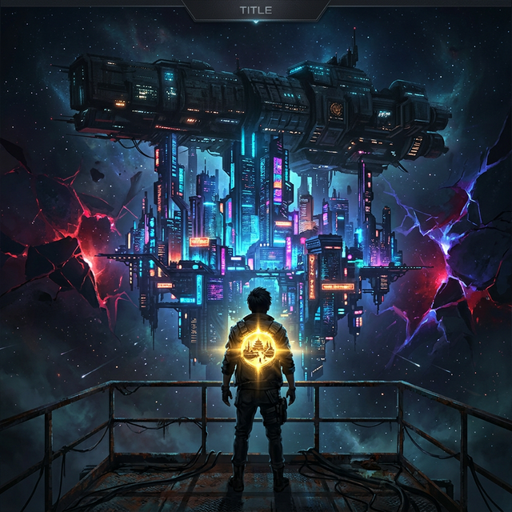

# 末日母艦：我的體內有個微縮文明

  

> *Mothership: Inner Micro-Civilization*

  

---

## 📖 故事簡介

母艦「方舟」載著最後的人類文明，航行在無盡的虛空中。

掛載在母艦上的巨型賽博都市，等級森嚴，資源匱乏。底層居民唯一的出路，就是踏入外域裂縫——那些連結異界的危險通道——用命去換取維持生存所需的資源。

**林燼**，一個欠著巨額生存稅的底層維修工兼拾荒者，在一次險些喪命的裂縫任務中，意外啟動了寄生在自己體內的神秘裝置——**「文明主機」**。

它能在體內孕育微縮文明、吸收信仰之力、加速煉化外域資源。

當所有人都在為了一口飯拼命掠奪的時候，林燼開始以文明為燃料，走上了一條與所有人截然不同的進化之路。

但隨著力量的增長，他逐漸看見了這個世界不願被看見的真相——

**整座賽博都市、外域裂縫、高不可攀的統治階層……不過是更高維度收割體系中，一座精心設計的牧場。**

而他，要做的不是逃離牧場。

**是把整座牧場，連根拔起。**

---

## 🔥 三大看點

| 看點 | 說明 |
|:---:|:---|
| ⚔️ **極限生存** | 高壓稅制、裂縫怪物、黑市火拼——底層沒有一天是安全的 |
| 🧬 **文明養成** | 體內培育微縮文明，從原始部落到科技時代，信仰反哺主角戰力 |
| 🕸️ **層層揭秘** | 母艦的真相、高層的目的、裂縫的本質——每一卷撕開一層謊言 |

---

## 🚀 立即閱讀

**🔗 [點此進入線上閱讀](https://skydreamer0.github.io/novel_ark-micro-civ/)**

---

## 📂 設定資料庫

想深入了解這個世界的底層邏輯？以下是核心設定文檔：

| 分類 | 文檔 |
|:---|:---|
| 🌐 世界觀 | [`CANON_world.md`](02_PROJECT_DATABASE/CANON_world.md) — 世界規則、OS 隱喻、資源循環、勢力地盤、術語表 |
| 👥 角色與陣營 | [`CANON_characters.md`](02_PROJECT_DATABASE/CANON_characters.md) — 角色卡與跨卷弧線（勢力索引見 `CANON_world.md` §17） |
| ⚙️ 力量／資源／人口 | [`CANON_power.md`](02_PROJECT_DATABASE/CANON_power.md) — 主機 V0–V14、L/H/碎片/燃料、阿卡夏熔爐、雙人口體系 |
| 📖 當前劇情狀態 | [`STATE.md`](02_PROJECT_DATABASE/STATE.md) — 章節錨點、開放伏筆、衝突弧線、續寫決策清單 |
| ✍️ 寫作風格與規則 | [`STYLE.md`](02_PROJECT_DATABASE/STYLE.md) · [`RULES.md`](02_PROJECT_DATABASE/RULES.md) |
| 🔮 未來規劃 | [`FUTURE.md`](02_PROJECT_DATABASE/FUTURE.md) — V8–V14 終局世界觀、章節大綱、寫作路線圖、字數進度 |
| 📚 各卷架構 | [`VOLUMES/`](02_PROJECT_DATABASE/VOLUMES/) — vol01–vol06（第五卷分 a/b/c） |

---

## 📊 寫作進度

| 卷 | 章節 | 標題 | 狀態 |
|:---:|:---:|:---|:---:|
| 第一卷 | Ch.1–30 | 艙底種火 | ✅ 完稿 |
| 第二卷 | Ch.31–60 | 裂縫稅戰 | ✅ 完稿 |
| 第三卷 | Ch.61–90 | 聖城試煉 | ✅ 完稿 |
| 第四卷 | Ch.91–120 | 投放名冊 | ✅ 完稿 |
| 第五卷 | Ch.121–160 | 黑箱斷流 | ✅ 完稿 |
| **第六卷第一幕** | **Ch.161–175** | **母艦全面反制** | **✅ 完稿** |
| **第六卷第二～三幕** | **Ch.176–210** | **權限戰爭（規劃）** | **⏳ 規劃中** |

> 最後更新：2026-05-30｜目前完成 175 章，全書規劃 390+ 章（完成度 44.9%）
