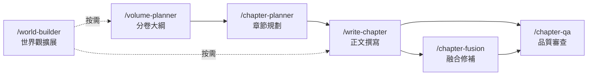

# 《微光文明》專案架構與工作流審查報告

> 審查日期：2026-05-17
> 範圍：目錄結構、資料庫設計、6 個工作流、1 個技能、跨文件一致性

---

## 一、總體評級：🟢 架構成熟度高，可進入穩定連載階段

你的專案在同類「AI 輔助長篇小說」項目中已屬**高度專業化**的水準。具備：

- ✅ 清晰的兩層目錄分離（正文 vs 資料庫）
- ✅ 完整的 AI 入口層（`.ai/SUMMARY.md` + `INDEX.md`）
- ✅ 六道工作流覆蓋完整寫作生命週期（規劃→撰寫→融合→QA→世界觀→分卷）
- ✅ 進度儀表板與伏筆追蹤系統
- ✅ 封存區隔離（`99_ARCHIVE/`）

**但仍存在可修復的結構性問題**，主要集中在「工作流內路徑斷裂」和「追蹤系統單點故障」兩個面向。

---

## 二、架構審查：目錄結構

### 2.1 現行結構圖

```
novel_ark-micro-civ/
├── .ai/                     ← AI 入口（SUMMARY + INDEX + 視角示範）
├── .agent/
│   ├── workflows/ (6)       ← 工作流
│   ├── skills/ (1)          ← novel-writer 技能
│   └── prompts/ (空)        ← ❗ 未使用
├── 01_NOVEL_CONTENT/        ← 正文 120 章 (4 卷)
├── 02_PROJECT_DATABASE/
│   ├── 00_CORE/ (8 檔)      ← 核心設定
│   ├── 01_RULES/ (8 檔)     ← 寫作規則
│   ├── 02_DETAILS/          ← 補充細節 + 儀表板
│   └── 99_ARCHIVE/          ← 封存區
└── [Web Reader 相關檔案]
```

### 2.2 優點

| 項目 | 評語 |
|---|---|
| 兩層分離 | `01_NOVEL_CONTENT/` 與 `02_PROJECT_DATABASE/` 乾淨分離，正文不被設定污染 |
| AI 入口 | `.ai/SUMMARY.md` 作為「記憶喚醒」入口非常好，可以在最少 token 消耗下啟動全局脈絡 |
| 封存隔離 | `99_ARCHIVE/` 加 `no_crawl/` 明確禁止 AI 讀取，避免舊設定污染 |
| 編號命名 | `00_CORE → 01_RULES → 02_DETAILS` 的編號順序暗示讀取優先級 |
| 模板庫 | `02_DETAILS/03_templates/` 含 5 套寫作模板，直接可用 |

### 2.3 問題

| # | 問題 | 嚴重度 | 說明 |
|---|---|---|---|
| A1 | **`.agent/prompts/` 為空** | 🟡 | 佔位資料夾無內容。如無計畫使用，應刪除以避免混亂 |
| A2 | **進度儀表板位置不直覺** | 🟡 | `進度儀表板.md` 放在 `02_DETAILS/` 下，但它是全局統計性質，更適合放在 `00_CORE/` 或專案根目錄 |
| A3 | **無第五卷大綱佔位** | 🟡 | `01_NOVEL_CONTENT/` 裡沒有 `05_第五卷_黑箱斷流/` 資料夾，工作流啟動時會需要手動建立 |
| A4 | **`.ai/視角技法示範.md` 定位模糊** | 🟡 | 這是教學文件還是寫作參考？如果是後者，應歸入 `02_DETAILS/03_templates/` |

---

## 三、工作流審查（6 個工作流）

### 3.1 工作流覆蓋度



**覆蓋度評級：🟢 完整。** 從分卷規劃到章節品管的完整生命週期都有對應工作流。

### 3.2 逐一審查

#### `/volume-planner` — 分卷大綱規劃
| 項目 | 評語 |
|---|---|
| 結構 | §1~§7 標準結構嚴謹，三幕式拆分合理 |
| 💡 強項 | Step 4 的護欄自檢（反派膨脹檢查、工具人檢查、財務壓力檢查）非常有價值 |
| ⚠️ **路徑斷裂** | 引用 `docs/00_企劃大綱/` 和 `NOVEL_WRITING_RULES.md` — **這些路徑在現行目錄結構中不存在** |
| ⚠️ 缺失 | 沒有指定輸出檔案的命名規則和存放位置 |

#### `/chapter-planner` — 章節節奏設計
| 項目 | 評語 |
|---|---|
| 結構 | 9 點標準輸出格式清晰，六位專家機制有效 |
| 💡 強項 | 強制要求「不可逆變化」和「結尾鉤子」避免水章 |
| ⚠️ **路徑斷裂** | Step 1 引用 `docs/01_正文/`、`docs/00_企劃大綱/01_分卷大綱/`、`docs/02_核心設定/` — **全部不存在** |
| ⚠️ 缺失 | 未指定規劃結果的存放位置（產出後往哪裡存？） |

#### `/write-chapter` — 正文撰寫
| 項目 | 評語 |
|---|---|
| 結構 | 4 Phase 完整，核心原則 7 條精準 |
| 💡 強項 | Phase 3 的標準輸出格式（推進主線 / 伏筆觸發 / 不可逆變化 / 下章壓力）是好的追蹤機制 |
| ⚠️ **路徑斷裂** | Phase 1 引用 `01_伏筆追蹤表.md` 和 `03_力量與文明系統.md` — 無完整路徑，容易指向錯誤檔案 |
| ⚠️ Phase 4 引用 | `05_專有名詞辭典.md` — 實際路徑是 `02_PROJECT_DATABASE/00_CORE/03_glossary.md` |
| ⚠️ 缺失 | 未明確指定正文寫入路徑（應指向 `01_NOVEL_CONTENT/0X_第X卷/`） |

#### `/chapter-fusion` — 融合修補
| 項目 | 評語 |
|---|---|
| 結構 | 簡潔有效，2 Phase 足夠 |
| 💡 強項 | 「3 個斷裂點 + 修補策略」的分析輸出格式非常好 |
| ✅ 路徑 | 未引用特定路徑，反而依賴使用者提供上下文，設計合理 |
| ⚠️ 缺失 | 未自動觸發 QA（僅「建議」接續 `/chapter-qa`） |

#### `/chapter-qa` — 品質審查
| 項目 | 評語 |
|---|---|
| 結構 | 5 Step 完整，三級評級系統（🟢🟡🔴）直覺 |
| 💡 強項 | 六位專家表格的「一票否決權」設計使品控硬性化 |
| ⚠️ **路徑斷裂** | Step 1 引用 `docs/01_正文/` 和 `NOVEL_WRITING_RULES.md` — **不存在** |
| ⚠️ Step 4 引用 | `01_伏筆追蹤表.md` 和 `05_專有名詞辭典.md` — 無完整路徑 |
| ⚠️ 書名不一致 | 本文件仍使用舊書名《末日母艦》，應統一為《微光文明》 |

#### `/world-builder` — 世界觀擴展
| 項目 | 評語 |
|---|---|
| 結構 | 4 Step 完整，衝突檢查三重硬約束嚴謹 |
| ⚠️ **路徑斷裂** | Step 1 全部引用 `docs/03_世界觀/` 和 `docs/02_核心設定/` — **不存在** |
| ⚠️ Step 4 引用 | 寫入路徑也全部指向 `docs/03_世界觀/` — **不存在** |

### 3.3 路徑斷裂問題總結

> [!CAUTION]
> **5 / 6 個工作流引用了已不存在的路徑。** 這是目前最嚴重的結構性問題。
> 工作流寫於舊目錄結構（`docs/` 體系）時代，專案重組後路徑未同步更新。

**受影響路徑映射：**

| 工作流中的舊路徑 | 應改為 |
|---|---|
| `docs/01_正文/` | `01_NOVEL_CONTENT/0X_第X卷/` |
| `docs/00_企劃大綱/01_分卷大綱/` | `02_PROJECT_DATABASE/00_CORE/02_plot.md`（或需新增分卷大綱子目錄） |
| `docs/00_企劃大綱/02_寫作與追蹤/01_伏筆追蹤表.md` | `02_PROJECT_DATABASE/00_CORE/05_foreshadowing.md` |
| `docs/02_核心設定/03_力量與文明系統.md` | `02_PROJECT_DATABASE/02_DETAILS/02_power/主機版本能力詳表.md` |
| `docs/03_世界觀/*.md` | `02_PROJECT_DATABASE/02_DETAILS/01_worldview/*.md` |
| `NOVEL_WRITING_RULES.md` | `02_PROJECT_DATABASE/01_RULES/01_writing_rules.md` |
| `05_專有名詞辭典.md` | `02_PROJECT_DATABASE/00_CORE/03_glossary.md` |

---

## 四、技能審查 (novel-writer)

### 4.1 評級：🟢 設計優秀，minor issues

| 項目 | 評語 |
|---|---|
| 濃縮度 | 175 行內涵蓋全部核心規則、設定、錨點和品質閘門 — 極度高效 |
| 必讀清單 | 7 步讀取順序精確，token 消耗可控 |
| 品質閘門 | 6 關強制檢查 + 退回機制 |
| 後續步驟 | 自動同步 plot / foreshadowing / SUMMARY |

### 4.2 問題

| # | 問題 | 說明 |
|---|---|---|
| S1 | **技能與工作流重疊** | SKILL.md 第三部分（寫作規則濃縮）、第五部分（品質閘門）與 `/write-chapter`、`/chapter-qa` 工作流有大量重複內容 |
| S2 | **第120章錨點硬編碼** | 技能文件內的「第120章狀態錨點」是靜態的，一旦續寫第121章後就會過時。應改為指向 `02_plot.md` 的動態讀取 |
| S3 | **蘇嵐/蘇嵐混用** | SKILL.md 中用「蘇嵐」，SUMMARY.md 中用「蘇嵐」（嵐 vs 岚），需統一 |

---

## 五、跨文件一致性檢查

| # | 問題 | 涉及檔案 | 說明 |
|---|---|---|---|
| C1 | **書名不一致** | `chapter-qa.md` | 使用《末日母艦》，其他全部使用《微光文明》 |
| C2 | **蘇嵐/蘇嵐** | SKILL.md vs SUMMARY.md vs characters.md | 兩種寫法混用 |
| C3 | **六位專家定義位置分散** | `/chapter-planner`、`/chapter-qa`、`/write-chapter` | 三個工作流各自描述六位專家，但角色定義略有差異。建議統一定義一次，工作流引用 |
| C4 | **伏筆追蹤表名稱混亂** | 各工作流 | 有的叫 `01_伏筆追蹤表.md`，有的叫 `05_foreshadowing.md`，實際只有一份 |

---

## 六、改善建議（按優先級排列）

### 🔴 必須修復（第五卷續寫前）

| # | 建議 | 工作量 |
|---|---|---|
| **R1** | **統一修復所有工作流路徑** — 將 5 個工作流中的舊 `docs/` 路徑全部替換為現行 `01_NOVEL_CONTENT/` 和 `02_PROJECT_DATABASE/` 路徑 | 1 小時 |
| **R2** | **統一書名為《微光文明》** — 修復 `chapter-qa.md` 中的《末日母艦》 | 5 分鐘 |
| **R3** | **統一角色名寫法** — 全域搜尋「蘇嵐」和「蘇嵐」，統一為一種 | 10 分鐘 |
| **R4** | **建立第五卷資料夾** — `01_NOVEL_CONTENT/05_第五卷_黑箱斷流/` | 1 分鐘 |

### 🟡 建議改善（提升效率）

| # | 建議 | 說明 |
|---|---|---|
| **Y1** | **將六位專家定義抽離為獨立檔案** | 在 `02_PROJECT_DATABASE/01_RULES/` 下新增 `09_expert_panel.md`，各工作流引用而非重複定義 |
| **Y2** | **SKILL.md 中的錨點改為動態引用** | 刪除硬編碼的「第120章狀態錨點」和「第五卷開局三條敘事線」，改為「讀取 `02_plot.md` 最新錨點」的指令 |
| **Y3** | **為工作流加入輸出路徑指定** | `/chapter-planner` 和 `/volume-planner` 的產出應指定明確存放位置 |
| **Y4** | **刪除空的 `.agent/prompts/` 資料夾** | 或填入常用提示詞模板 |
| **Y5** | **在進度儀表板中加入伏筆到期預警** | 將 `07_conflict_arcs.md` 中的 🔴 項目自動摘要到儀表板 |
| **Y6** | **新增「一鍵全流程」的整合工作流** | 串聯 planner → write → QA 三步，減少手動切換 |
| **Y7** | **`chapter-fusion` 結尾自動觸發 QA** | 從「建議」改為「自動執行」，避免遺漏 |

### 🟢 可選優化（長期維護）

| # | 建議 | 說明 |
|---|---|---|
| **G1** | **將 `視角技法示範.md` 從 `.ai/` 移入 `02_DETAILS/03_templates/`** | 保持 `.ai/` 只存放入口檔案（SUMMARY + INDEX） |
| **G2** | **為進度儀表板加入自動統計腳本** | 目前手動更新，可寫一個 PowerShell/Python 腳本自動掃描正文字數 |
| **G3** | **為 `02_DETAILS/01_worldview/` 新增時間線交叉引用** | `時間線年表.md` 與 `母艦空間布局參照.md` 可加入章節回指連結 |
| **G4** | **SKILL.md 版本號管理** | 技能隨正文進度演化，建議加入版本號（如 `v2.0 — 第120章後`）以追蹤變更 |
| **G5** | **未達標章節清單整合到衝突弧線表** | 將 9 章未達標列入「技術債」追蹤，明確是否要回頭擴寫 |
| **G6** | **工作流加入 `turbo-all` 註解** | 考慮在所有讀取步驟密集的工作流（如 `world-builder`）頂部加入 `// turbo-all`，加速自動執行 |

---

## 七、結論

你的專案架構在「AI 輔助長篇小說」領域已經是**非常成熟的設計**。六道工作流覆蓋了完整的寫作生命週期，資料庫分層清晰，品質閘門有效。

**最急迫的問題只有一個：工作流路徑斷裂 (R1)**。這是當初目錄重組後的歷史遺留，修復後整個系統就能順暢運作。其餘改善項都是效率優化而非功能缺失。

建議修復順序：

```
R1 → R2 → R3 → R4 → Y2 → Y1 → Y3 → 其餘
```

如果你希望，我可以直接幫你**一次性修復所有 R 級問題（路徑、書名、角色名、建資料夾）**。
