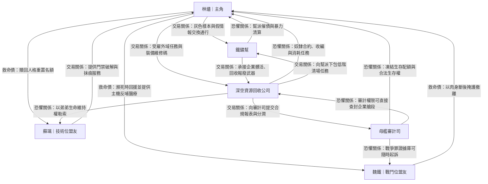

# 角色關係圖（第一卷核心）

> 用途：快速檢視主角團與外部勢力的利益鏈、壓制鏈與人情鏈，方便在章回中安排背叛、談判與救援戲。

## 圖例
- **交易關係**：以資源、情報、庇護或通行權交換為主。
- **恐懼關係**：一方掌握生殺或制度性懲罰，另一方因風險而服從。
- **救命債**：在生死事件中形成的高黏性人情鏈，通常會壓過短期利益。

## 關係網（Mermaid）

## 寫作使用建議
- 每次重大衝突前，先確認本章啟動的是哪一種關係線，避免角色動機漂移。
- 若要安排背叛情節，優先從「交易關係」切入；若要安排犧牲高光，優先從「救命債」切入。
- 「恐懼關係」建議每 3～5 章重申一次具體懲罰手段，維持制度壓迫感。
